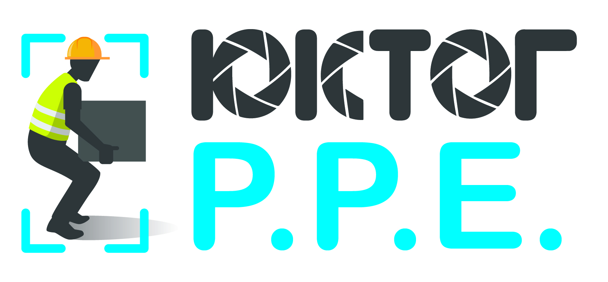
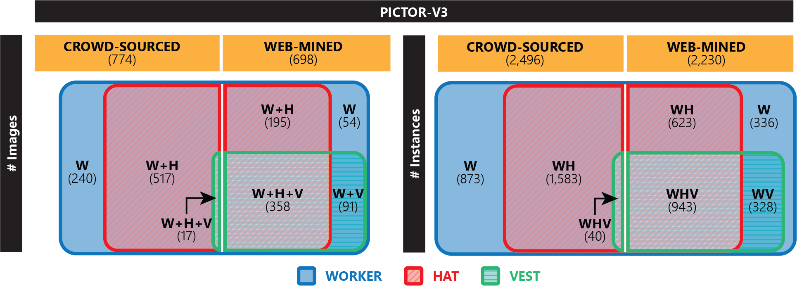
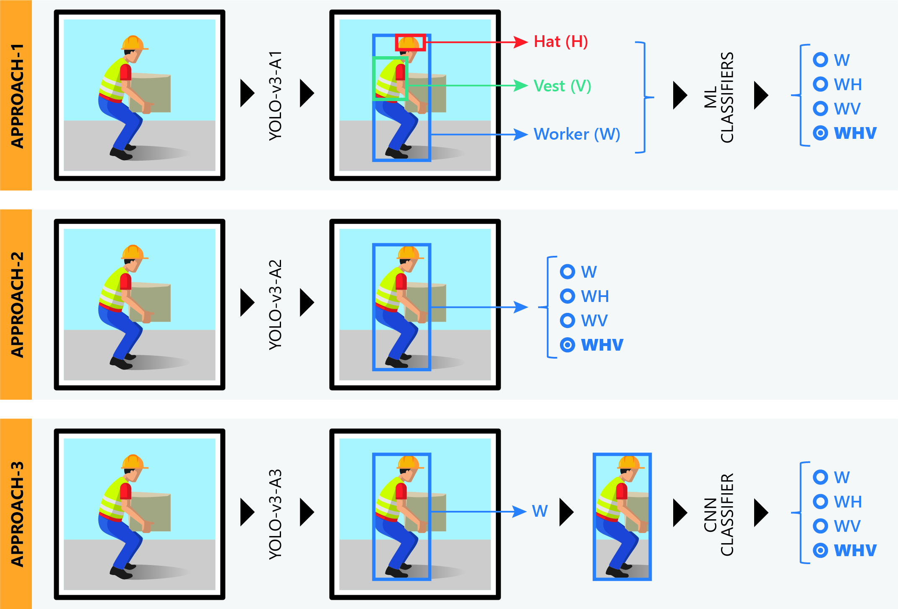
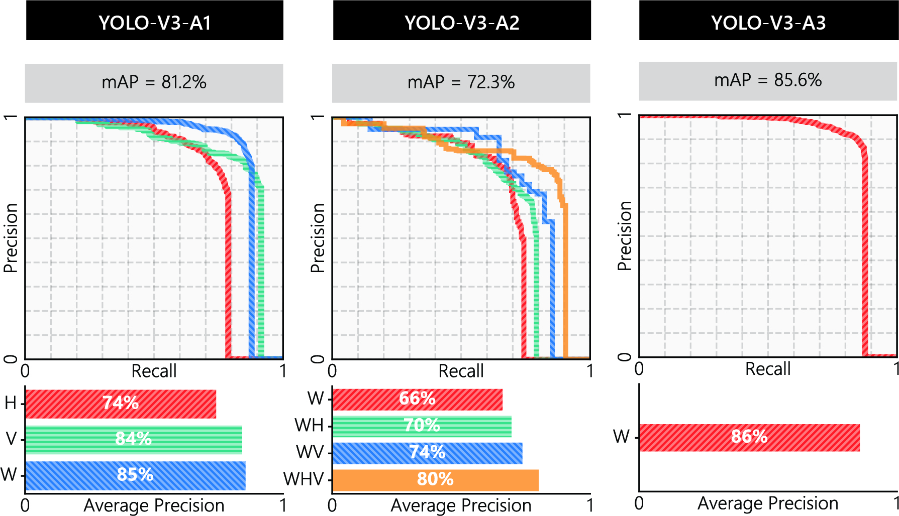
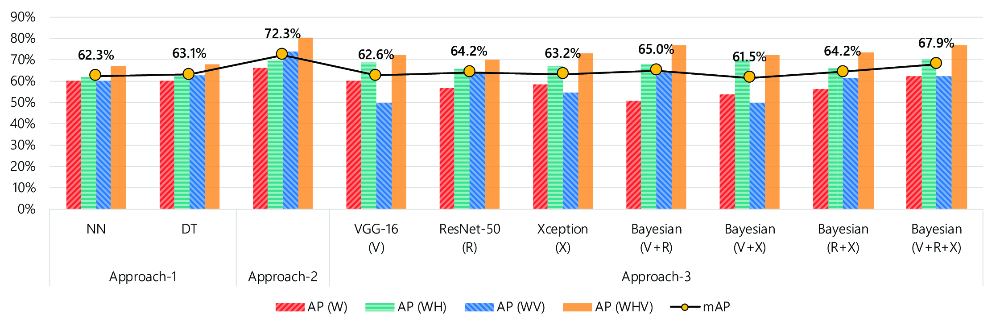

# **Real-time Detection of Personal-Protective-Equipment (PPE)**

## **Table of Contents**
1. [Introduction](#introduction)
2. [Implementation](#implementation)
3. [Dataset](#dataset) ([download](https://drive.google.com/drive/folders/19uUR6EJPQzMeK0YpsxRm51wMZzDmcsv6?usp=sharing))
4. [Pre-trained models](#pre-trained-models) ([download](https://drive.google.com/drive/folders/13tCdROHnS0c5VibW1VO8pOEj0rXEvvGj?usp=sharing))
5. [Tutorials](#tutorials)

## **Introduction**

The repository presents Tensorflow 2.0 (Keras) implementation of real-time detection of PPE (e.g., hard hat, safety vest) compliances of workers. The detailed procedures can be found in the following paper.

### Article

[**Deep Learning for Site Safety: Real-Time Detection of Personal Protective Equipment**](https://authors.elsevier.com/a/1aQ0o3IhXMjOmb) \
Nipun D. Nath, Amir H. Behzadan, Stephanie G. Paal \
Automation in Construction 112, pp. 103085

Please cite the article if you use the dataset, model or method(s), or find the article useful in your research. Thank you!

### LaTeX citation:

@article{Nath2020,
    author  = {Nipun D. Nath and Amir H. Behzadan and Stephanie G. Paal},
    title   = {Deep Learning for Site Safety: Real-Time Detection of Personal Protective Equipment},
    journal = {Automation in Construction},
    volume  = {112},
    year    = {2020},
    pages   = {103085}

## **Implementation**

### Dependencies
- `tensorflow 2.0`
- `numpy`
- `opencv`
- `matplotlib`
- `pandas`

Please follow the [`Detection-Example.ipynb`](https://github.com/nipundebnath/pictor-ppe/blob/master/Detection-Example.ipynb) notebook to test the models.

## **Dataset**

### Dataset statisctics

The dataset (named **Pictor-v3**) contains 774 crowd-sourced and 698 web-mined images. Crowd-sourced and web-mined images contain 2,496 and 2,230 instances of workers, respectively. A brief statistics of the dataset is shown in the following figure.

### Annotation example

**@TODO:** Please stay tuned!

### Download the crowd-sourced dataset

The crowdsourced images and annotated labels can be found in this [Google Drive folder](https://drive.google.com/drive/folders/19uUR6EJPQzMeK0YpsxRm51wMZzDmcsv6?usp=sharing).

## **Methods/Approaches**

The paper presents three different approaches for verifying PPE compliance:

**Approach-1**: YOLO-v3-A1 model detects worker, hat, and vest (three object classes) individually. Next, ML classifiers (Neural Network, Decision Tree) classify each worker as W (wearing no hat or vest), WH (wearing only hat), WV (wearing only vest), or WHV (wearing both hat and vest).

**Approach-2**: YOLO-v3-A2 model localizes workers in the input image and directly classifies each detected worker as W, WH, WV, or WHV.

**Approach-3**: YOLO-v3-A3 model first detects all workers in the input image and then, a CNN-based classifier model (VGG-16, ResNet-50, Xception) was applied to the cropped worker images to classify the detected worker as W, WH, WV, or WHV.

## **Results**

- The mean-average-precision (mAP) of YOLO models in detecting classes:

- The overall mAP of verifying workers' PPE compliance:

- The best is Approach-2 (72.3% mAP).

## **Pre-trained Models**

Models trained on Pictor-v3 dataset are available in the [Google Drive folder](https://drive.google.com/drive/folders/13tCdROHnS0c5VibW1VO8pOEj0rXEvvGj?usp=sharing).

- YOLO-v3-A1
- YOLO-v3-A2
- YOLO-v3-A3
- ML Classifiers (Approach-1)
- CNN Classifiers (Approach-3)

## **Tutorials**

Please follow the notebooks in [tutorials](https://github.com/nipundebnath/pictor-ppe/blob/master/tutorials/) folder to learn more about:
- building YOLO model from scratch using tensorflow 2.0
- interpret YOLO output and convert to bounding boxes with class label and confidence score.

**@TODO:** Please stay tuned! More tutorials are coming soon.
